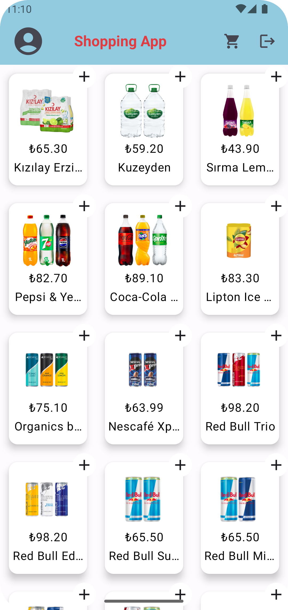
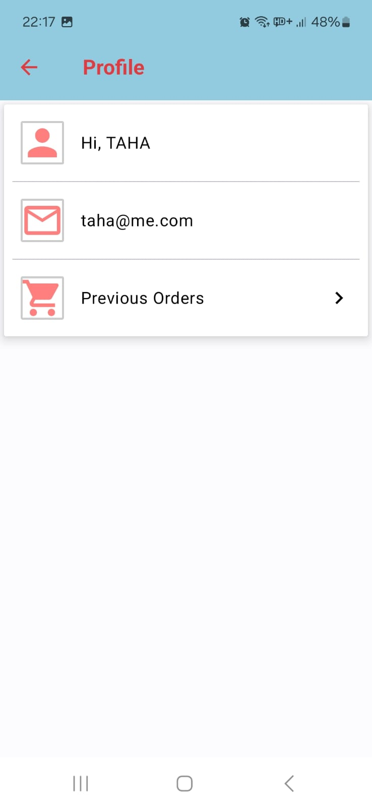
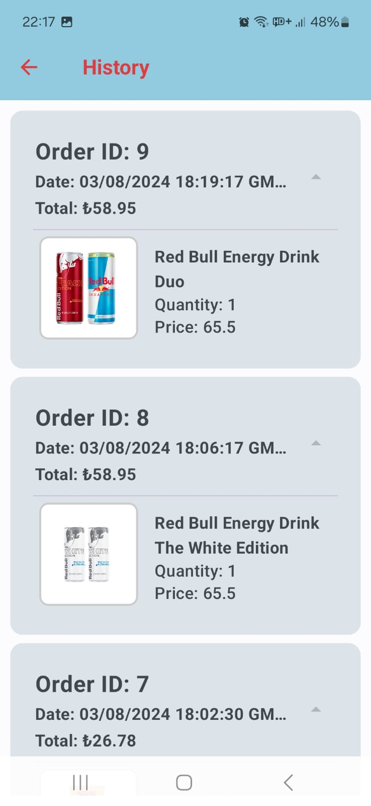
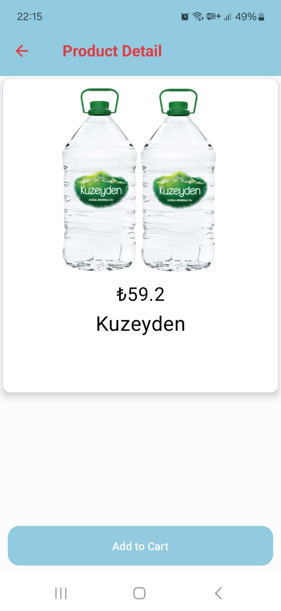
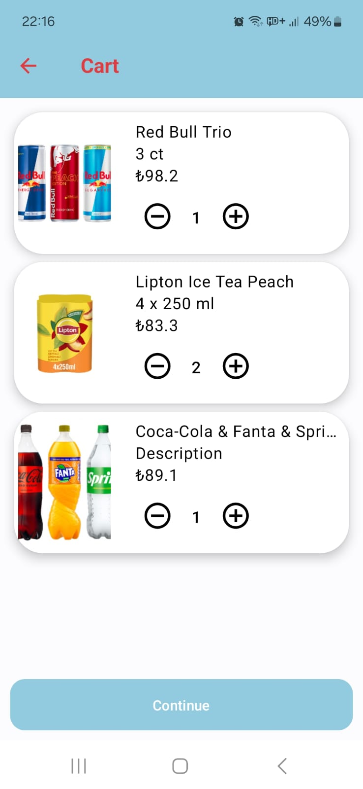
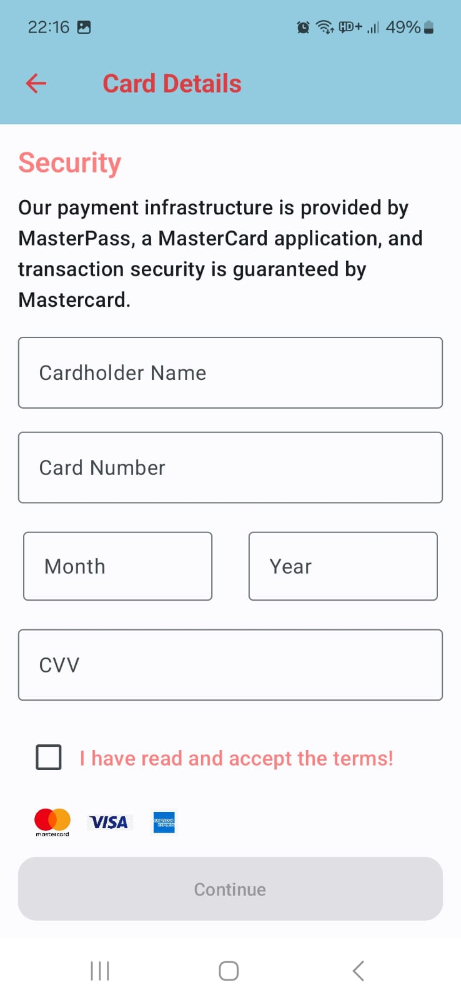
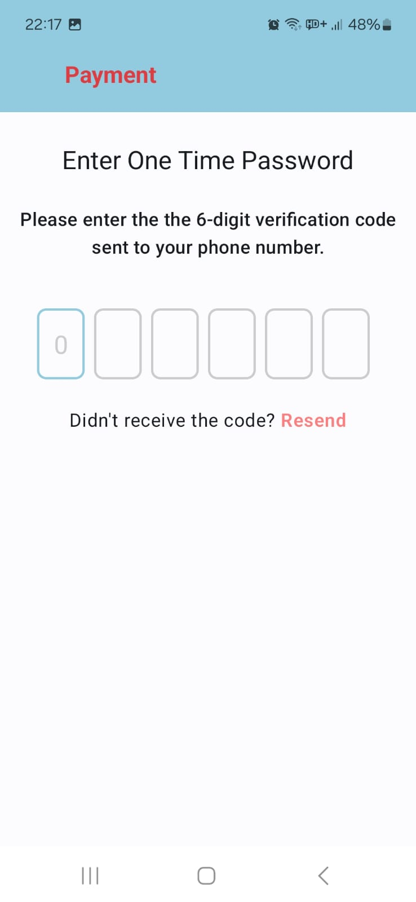
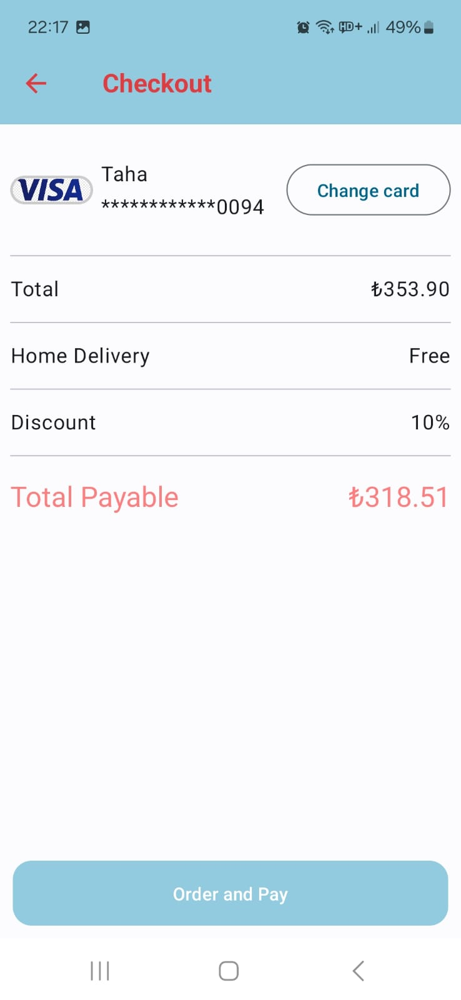
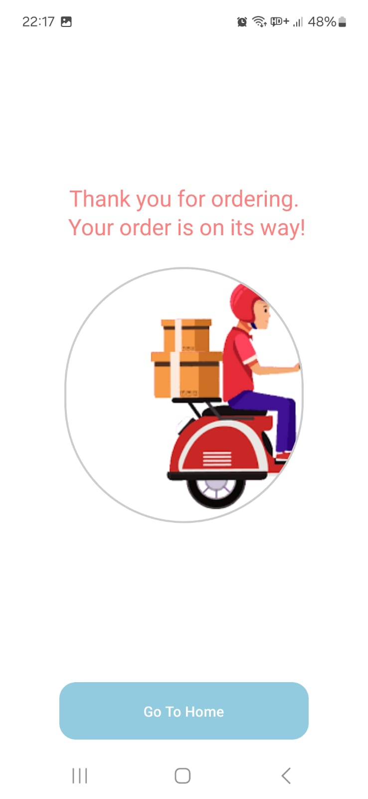

# ECommerce
Sample E-Commerce App

The backend integration with Firestore and Firebase handles user authentication and data storage. The app employs the following:
- Jetpack Compose
- Clean architecture
- MVVM
- Retrofit
- Room
- Firebase (FireStore & Authentication)
- Hilt and Dagger for Dependency Injection
- Coroutines for asynchronous operations
- Coil
- PaymentSDK module

## Screenshots
<table>
  <tr>
    <td align="center"></td>
    <td align="center"></td>
    <td align="center"></td>
  </tr>
  <tr>
    <td align="center"></td>
    <td align="center"></td>
    <td align="center"></td>
  </tr>
   <tr>
    <td align="center"></td>
    <td align="center"></td>
    <td align="center"></td>
  </tr>
<tr>
    <td align="center"></td>
  </tr>

</table>